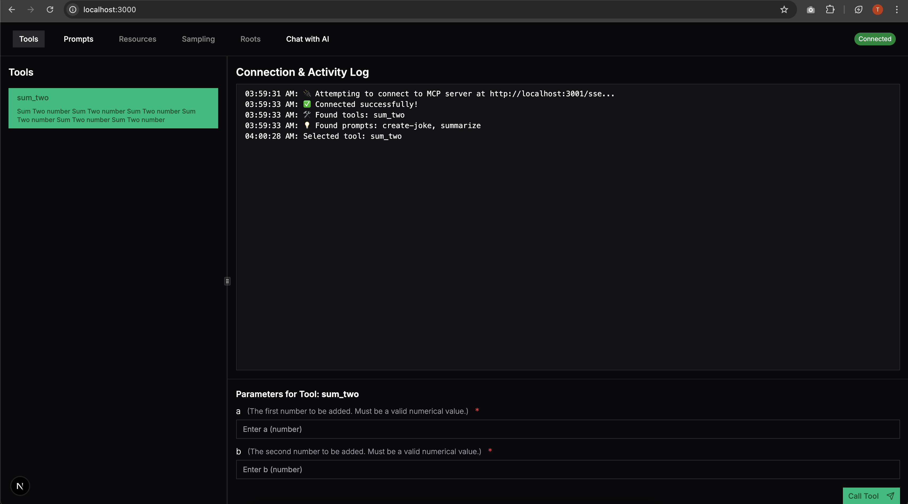
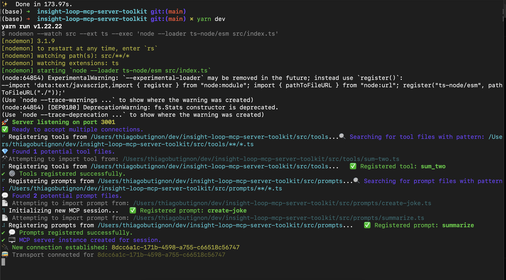
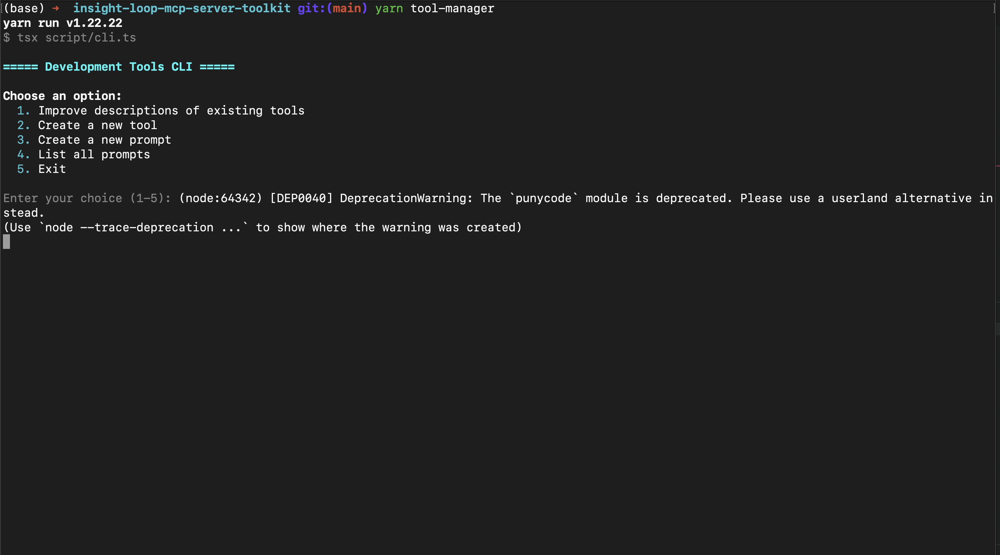
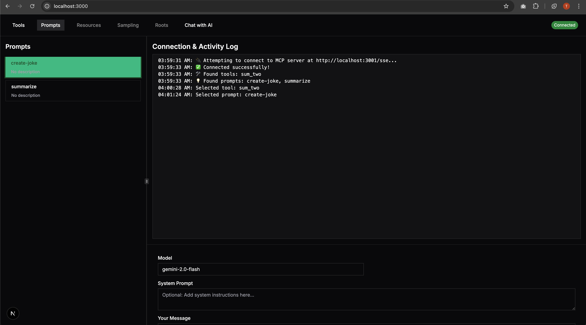

# Dynamic MCP SSE Server & Development Tools

## 🚀 Overview

This project provides a Model Context Protocol (MCP) server implementation using Server-Sent Events (SSE) for transport. It features dynamic loading of tools and prompts from dedicated directories (`./src/tools` and `./src/prompts`). The project also includes a command-line interface (CLI) for development assistance (like scaffolding and description enhancement) and a web-based frontend inspector for interacting with the running MCP server.

## ✨ Key Features

- **📡 MCP Server with SSE Transport**: Implements the MCP standard using efficient Server-Sent Events for real-time communication.
- **🧰 Dynamic Tool & Prompt Registration**: Automatically discovers and registers tools (`.ts` files in `./src/tools`) and prompts (`.ts` files in `./src/prompts`) upon server startup or new connection.
- **⚙️ Concurrent Client Handling**: Manages multiple simultaneous client connections via SSE, isolating server instances per connection.
- **💻 Development CLI**: Offers utilities to streamline development:
  - 🏗️ Automated scaffolding for new tools and prompts.
  - 🤖 LLM-powered enhancement of tool descriptions for better contextualization.
  - 📝 Listing available prompts.
- **✨ Web-based MCP Inspector**: A frontend application (built with Next.js and Shadcn UI) allowing users to:

  - 🔗 Connect to the running MCP SSE server.
  - 🔍 View lists of available tools and prompts with their schemas.
  - ⚡ Execute tools and prompts by providing parameters through a form.
  - 📊 Monitor connection status and view activity logs in real-time.

  

## 🧩 Core Components

1.  **`src/index.ts`**:

    - The main entry point for the MCP server.
    - Uses Express.js to handle HTTP requests and establish SSE connections at the `/sse` endpoint.
    - Manages client sessions and associated MCP server instances.
    - Orchestrates the dynamic loading of tools and prompts using helper functions (`registerToolsFromDirectoryRecursive`, `registerPromptsFromDirectoryRecursive`).
    - Includes dynamic CORS middleware.



2.  **`script/cli.ts`**:

    - A command-line utility designed to aid in the development and maintenance of tools and prompts.
    - Provides an interactive menu for creating new tool/prompt files from templates and improving existing tool descriptions (using an external LLM configured via environment variables).



3.  **`mcp-inspector-frontend/`**:
    - A standalone Next.js application serving as a graphical user interface for the MCP server.
    - Connects to the server's `/sse` endpoint using the `@modelcontextprotocol/sdk/client/sse.js` transport.
    - Provides a user-friendly way to inspect server capabilities (tools, prompts) and interact with them.



## Getting Started

### ⚙️ Prerequisites

- Node.js (latest LTS recommended)
- Yarn (v1 or later)

### ⬇️ Installation

1.  **Clone the repository (if you haven't already).**
2.  **Install root dependencies:**
    ```bash
    yarn install
    ```
3.  **Install frontend dependencies:**
    ```bash
    cd mcp-inspector-frontend
    yarn install
    cd ..
    ```

### 🔑 Environment Configuration

1.  **Server:** Copy `.env.example` to `.env` in the project root. Fill in any necessary environment variables (e.g., API keys if your tools/CLI require them).
2.  **Frontend Inspector:** Create a `.env.local` file inside the `mcp-inspector-frontend/` directory. Add the URL of your running MCP server:
    ```plaintext
    # mcp-inspector-frontend/.env.local
    NEXT_PUBLIC_MCP_SERVER_URL=http://localhost:3001
    ```
    Replace `http://localhost:3001` if your server runs on a different port or host.

### 🚀 Running the Project

1.  **Build the server and CLI:**
    ```bash
    yarn build
    ```
2.  **Run the MCP Server:**

    ```bash
    yarn start
    ```

    _(Alternatively, use `yarn dev` if a development script with hot-reloading is configured)_

3.  **Run the Frontend Inspector:**

    ```bash
    cd mcp-inspector-frontend
    yarn dev
    ```

    The inspector will typically be available at `http://localhost:3000`.

4.  **Run the Tool Manager CLI:**
    ```bash
    yarn tool-manager
    ```
    This command executes `build/script/cli.js` using `node`. Follow the interactive prompts in your terminal to manage tools and prompts. The CLI provides options to:
    - Improve descriptions of existing tools
    - Create a new tool
    - Create a new prompt
    - List all prompts

## 🕹️ Usage

- **📡 MCP Server**: Runs in the background (started via `yarn start` or `yarn dev`). It listens for incoming SSE connections on the configured port (default: 3001). Tools and prompts defined in the respective directories will be available to connected clients.
- **💻 Development CLI**: Execute `node build/script/cli.js` in your terminal. Choose options from the menu to create new tools/prompts or improve descriptions.
- **✨ MCP Inspector**: Access the frontend application in your web browser (default: `http://localhost:3000`). It will attempt to connect to the `NEXT_PUBLIC_MCP_SERVER_URL`. Once connected, use the sidebar to browse available tools and prompts. Select one to view its details and input parameters, then execute it using the provided form. The log panel shows connection status and interaction history.

## 🗺️ Roadmap

- [ ] Docker support
- [ ] Improve layout Chat with LLM
- [ ] Python Example
- [ ] MCP Server Resources
- [ ] MCP Server Sampling
- [ ] MCP Server Roots
- [ ] How to deploy?

## ❓ FAQ

<details>
<summary>1. What is the MCP SSE Server?</summary>

**Answer:** The MCP (Model Context Protocol) SSE Server is a real-time communication server that uses Server-Sent Events (SSE) to deliver messages to connected clients. It adheres to the MCP standard, facilitating a structured and scalable communication protocol for AI-driven tools and prompts. This design enables efficient updates and interactions, making it ideal for projects that require dynamic, live data streaming and command execution.

</details>

<details>
<summary>2. How does dynamic tool and prompt registration work?</summary>

**Answer:** Upon starting up or when a new client connection is established, the MCP server automatically scans dedicated directories (`./src/tools` and `./src/prompts`). It registers any new or updated TypeScript files found there. This dynamic discovery process ensures that any changes or additions to your tools and prompts are readily available to connected clients without needing to restart the server manually.

</details>

<details>
<summary>3. What are Server-Sent Events (SSE) and why are they used?</summary>

**Answer:** Server-Sent Events (SSE) provide a mechanism for servers to push data to clients over a standard HTTP connection. Unlike WebSockets, which enable bi-directional communication, SSE focuses on one-way communication from server to client. This makes SSE particularly well-suited for live updates such as monitoring logs, showing dynamic tool execution status, or streaming notifications in real time.

</details>

<details>
<summary>4. How do I add or create new tools and prompts?</summary>

**Answer:** You can extend the project easily by adding new TypeScript files to the `./src/tools` or `./src/prompts` directories. Additionally, the project includes a CLI tool that guides you through:

- Creating a New Tool/Prompt: Use interactive scaffolding that generates boilerplate code and the necessary file structure.
- Improving Existing Tool Descriptions: Leverage LLM-powered suggestions to enhance tool context and descriptions, ensuring they are detailed and user-friendly.
- Listing Available Prompts: Quickly view a list of prompts available in the system from the command line.
</details>

<details>
<summary>5. How do I configure the project?</summary>

**Answer:** Before running the project, ensure you configure the environment variables properly:

- Server Configuration: Copy the `.env.example` file to `.env` in the root directory and update any required API keys or settings.
- Frontend Inspector: In the `mcp-inspector-frontend` directory, create a `.env.local` file and specify the MCP server URL (e.g., `NEXT_PUBLIC_MCP_SERVER_URL=http://localhost:3001`). These steps ensure that both the backend server and the frontend interface are properly aligned with your development environment.
</details>

<details>
<summary>6. How do I run the MCP Server and Inspector?</summary>

**Answer:** After setting up the environment:

- Building the Project: Run `yarn build` to compile the server and CLI tools.
- Starting the Server: Launch the server with `yarn start` (or `yarn dev` if you prefer hot reloading during development).
- Running the Inspector: Navigate to the `mcp-inspector-frontend` directory, install dependencies with `yarn install`, then start the application using `yarn dev`. The inspector will typically be available at `http://localhost:3000`.
</details>

<details>
<summary>7. What is the role of the Development CLI?</summary>

**Answer:** The CLI is a powerful tool designed to enhance your development workflow. It provides:

- Automated Scaffolding: Quickly generate new tool or prompt files using predefined templates.
- LLM-Powered Enhancement: Automatically improve tool descriptions based on natural language processing models for clarity and context.
- Prompt Listing: Easily list and manage the available prompts, helping you keep track of your project's interactive components.
</details>

<details>
<summary>8. How does the web-based MCP Inspector benefit me?</summary>

**Answer:** The MCP Inspector is a user-friendly frontend application that connects to the server’s SSE endpoint. It allows you to:

- Inspect available tools and prompts, including schema definitions.
- Execute tools by filling out parameter forms.
- Monitor the connection status and view activity logs in real time. This visual layer is designed to ease the debugging process and provide an intuitive interface for interacting with your MCP server.
</details>

<details>
<summary>9. How can I contribute or seek support for this project?</summary>

**Answer:** Contributions are welcome! If you wish to help improve this project:

- Bug Reports and Feature Requests: Use the project’s issue tracker on your repository host (e.g., GitHub).
- Pull Requests: Review the contribution guidelines provided in the repository to ensure smooth integration of new code.
- Community Support: Engage with the community through discussion forums or project-specific chat channels if available.
</details>

<details>
<summary>10. What are the future enhancements mentioned in the roadmap?</summary>

**Answer:** The current roadmap highlights several exciting directions, including:

- Docker Support: Simplifying the deployment process using containerization.
- MCP Server Resources and Sampling: Enhancing resource management and providing sampling techniques to improve performance.
- Deployment Guidelines: Offering comprehensive guides for deploying the MCP server in production environments. These roadmap items are aimed at further refining the project’s scalability and ease of use for a broader audience.
</details>
